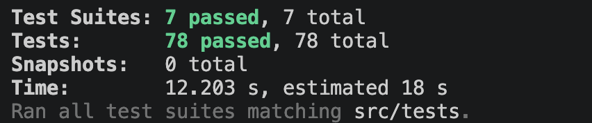

## 해당 브랜치의 역할

- ERC-20 Transfer 로그 조회
- 조회한 로그를 `TransferEvent` 도메인 모델로 디코딩
- 특정 지갑 기준 Transfer 이벤트 필터링
- 관련 `Transaction` 조회
- `Transaction` / `TransferEvent` 중복 없이 저장

## 관련이슈

-

## 구현내용

### 1. Domain Model

- `/domain/model/log.ts`
  - RPC에서 조회한 raw log를 표현하는 `Log` 도메인 모델
  - address, topics, data, blockNumber, blockTimestamp, transactionHash, logIndex에 대한 기본 검증 구현

- `/domain/model/transaction.ts`
  - Transfer 이벤트가 발생한 트랜잭션 정보를 표현하는 `Transaction` 도메인 모델
  - hash, from/to address, value, blockHash, blockNumber, blockTimestamp에 대한 기본 검증 구현

- `/domain/model/transfer-event.ts`
  - ERC-20 Transfer 이벤트 정보를 표현하는 `TransferEvent` 도메인 모델
  - tokenAddress, from/to address, value, blockNumber, transactionHash, logIndex에 대한 기본 검증 구현

### 2. Protocol / Repository Interface

- `/domain/protocol/log-reader.protocol.ts`
  - 블록 번호 / 블록 범위 기준으로 로그를 조회하기 위한 `LogReader` 인터페이스

- `/domain/protocol/transaction-reader.protocol.ts`
  - transactionHash 목록으로 트랜잭션 정보를 조회하기 위한 `TransactionReader` 인터페이스

- `/domain/protocol/decoder/transfer-event.decoder.ts`
  - `Log`를 `TransferEvent`로 변환하기 위한 `TransferEventDecoder` 인터페이스

- `/domain/repository/transaction.repository.ts`
  - `Transaction` 저장, 중복 확인, count 조회를 위한 `TransactionRepository` 인터페이스

- `/domain/repository/transfer-event.repository.ts`
  - `TransferEvent` 저장, 중복 확인, count 조회를 위한 `TransferEventRepository` 인터페이스

### 3. Shared / Blockchain Client

- `/shared/domain/protocol/blockchain-client.protocol.ts`
  - viem 같은 RPC에 직접 의존하지 않기 위한 `BlockchainClient` 인터페이스

- `/shared/viem/viem-blockchain-client.ts`
  - viem 기반 최신 블록, 로그, 트랜잭션 정보를 조회하는 `BlockchainClient` 구현체

### 4. Infrastructure

- `/infrastructure/rpc/blockchain-log-reader.ts`
  - `BlockchainClient`를 사용하여 블록 번호 / 범위의 로그를 조회하는 `LogReader` 구현체

- `/infrastructure/rpc/blockchain-transaction-reader.ts`
  - `BlockchainClient`를 사용하여 transactionHash 목록으로 트랜잭션을 조회하는 `TransactionReader` 구현체

- `/infrastructure/decoder/erc20-transfer-event.decoder.ts`
  - ERC-20 Transfer 이벤트를 해석하여 `TransferEvent` 도메인 객체로 변환하는 `Erc20TransferEventDecoder` 구현체

- `/infrastructure/database/postgres-transaction.repository.ts`
  - Prisma / PostgreSQL 기반 `TransactionRepository` 구현체
  - transactionHash 기준 중복 확인 / 저장 기능 구현

- `/infrastructure/database/postgres-transfer-event.repository.ts`
  - Prisma / PostgreSQL 기반 `TransferEventRepository` 구현체
  - transactionHash + logIndex 기준 중복 확인 / 저장 기능 구현

### 5. Service

- `/application/transfer-event.service.ts`
  - 블록 번호 / 범위 기준으로 로그 조회, Transfer 이벤트 인덱싱을 실행하는 진입점

- `/application/transfer-event-save.service.ts`
  - `Transaction`과 `TransferEvent`를 중복 없이 저장 기능 구현

- `/application/transfer-event-indexer.service.ts`
  - 로그 목록을 Transfer 이벤트로 디코딩, targetWalletAddress가 `from` / `to`에 포함된 이벤트만 필터링
  - 필터링된 이벤트의 transactionHash를 추출하여 트랜잭션 정보 조회 / 저장 구현

### 6. Test

- 도메인 모델 validation 테스트
- ERC-20 Transfer 이벤트 decoder 테스트
- Transfer 이벤트 인덱싱 테스트

## 중점 리뷰 사항

1. 구현체 분리

- 다른 파일에서 `blockchainClient` 인터페이스에 의존하고, `/shared/viem/viem-blockchain-client.ts`에 viem 구현체를 두는 것이 적절한지
- `/infrastructure/database/` 안에 postgres로 시작된 파일들은 각 repository의 구현체인데 다른 DB로 바뀐다고 했을 때 문제가 없는지?

2. DB 테스트

- repository test 안해도 된다고 들었는데 맞는지

## 스크린샷 / 테스트 결과

