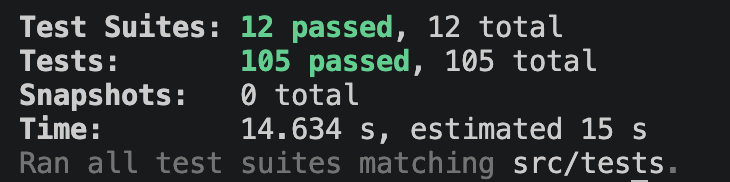

## 해당 브랜치의 역할

- 입력받은 블록 범위를 batch 단위로 분할
- 기존 `BACKFILL` checkpoint 기준으로 시작 블록 보정
- 각 batch 범위에 대해 Transfer 이벤트 인덱싱 실행
- batch 처리 완료 후 `BACKFILL` checkpoint 갱신
- Backfill 실행 및 상태 조회 API 제공

## 관련이슈

-

## 구현내용

### 1. Checkpoint

- `/checkpoint/domain/model/checkpoint.ts`
  - Backfill 작업의 마지막 처리 블록을 표현하는 `Checkpoint` 도메인 모델
  - type, lastProcessedBlock, updatedAt에 대한 기본 검증 구현

- `/checkpoint/domain/repository/checkpoint.repository.ts`
  - checkpoint 조회 / 갱신을 위한 `CheckpointRepository` 인터페이스

- `/checkpoint/application/checkpoint.service.ts`
  - checkpoint 조회와 갱신을 담당하는 checkpoint service
  - checkpoint type 기준으로 마지막 처리 블록 조회
  - 처리 완료 블록 기준 checkpoint upsert 기능 구현

- `/checkpoint/infrastructure/database/postgres-checkpoint.repository.ts`
  - Prisma / PostgreSQL 기반 `CheckpointRepository` 구현체
  - checkpoint type 기준 조회 기능 구현
  - checkpoint type 기준 upsert 기능 구현

- `/shared/types/checkpoint-type.enum.ts`
  - checkpoint 작업 타입

### 2. Backfill Domain Protocol / Service

- `/sync/domain/protocol/block-reader.protocol.ts`
  - 최신 블록 번호를 조회하기 위한 `BlockReader` 인터페이스

- `/sync/domain/service/backfill-validator.domain.service.ts`
  - Backfill 실행 전에 startBlock, endBlock, batchSize 검증
  - startBlock이 endBlock보다 큰 경우 방지
  - batchSize가 0 이하이거나 정수가 아닌 경우 방지
  - 음수 블록 번호 입력 방지

- `/sync/domain/service/backfill.domain.service.ts`
  - 입력받은 startBlock, endBlock, batchSize를 기준으로 Backfill batch 목록 생성
  - 각 batch의 fromBlock, toBlock 범위 계산
  - 마지막 batch가 endBlock을 초과하지 않도록 보정

### 3. Infrastructure

- `/sync/infrastructure/rpc/blockchain-block-reader.ts`
  - `BlockchainClient`를 사용하여 최신 블록 번호를 조회하는 `BlockReader` 구현체

### 4. Service

- `/sync/application/block-batch-processor.service.ts`
  - batch 단위로 `TransferEventService`를 실행
  - 각 batch 처리 완료 후 `BACKFILL` checkpoint 갱신
  - Transfer 이벤트 인덱싱 처리 결과를 누적

- `/sync/application/run-backfill.service.ts`
  - Backfill 실행 흐름을 담당하는 service
  - 기존 `BACKFILL` checkpoint가 있으면 checkpoint 이후 블록부터 처리하도록 시작 블록 보정
  - 입력받은 블록 범위를 batch 단위로 분할
  - 분할된 batch를 `BlockBatchProcessor`에 위임

### 5. API

- `/sync/entry-point/sync.controller.ts`
  - `POST /api/indexer/backfill` endpoint 구현
    - targetWalletAddress, startBlock, endBlock, batchSize 입력값 검증
    - Backfill 중복 실행 방지
    - Backfill 실행 상태 저장
  - `GET /api/indexer/status` endpoint 구현
    - latestBlock, backfill 상태, checkpoint, 저장된 transaction / transferEvent 개수 반환

### 6. Test

- Checkpoint 도메인 모델 validation 테스트
- Checkpoint repository 테스트
- Backfill 입력값 검증 테스트
- Backfill batch 분할 테스트
- Backfill 실행 service 테스트
- SyncController backfill / status 테스트

## 질문 사항

1. Checkpoint 관리

- Backfill / Forwardfill 동시 실행을 위한 Checkpoint 상태 관리 방법

2. Sync DB

- 별도의 스키마를 만드는 게 좋을지

2. Sync Controller

- 해당 파일에 Private 함수가 있는데 분리해야 하는지

3. RPC

- Backfill / Forwardfill에 대한 RPC 요청량을 하나로 묶어야 하는지

4. `/sync/application/run-backfill.service.ts` 객체 생성 방법

- constructure에 넣는 방법과 직접 주입하는 것의 차이점

## 스크린샷 / 테스트 결과

