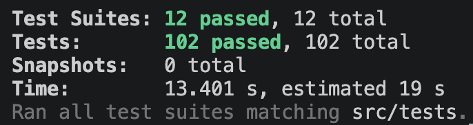

## 해당 브랜치의 역할

- `FORWARDFILL` checkpoint 기준으로 다음 처리 블록 결정
- 신규 블록을 polling 방식으로 감지
- 감지한 블록에 대해 Transfer 이벤트 인덱싱 실행
- 처리 완료 후 `FORWARDFILL` checkpoint 갱신
- Forwardfill 실행 / 중단 / 상태 조회 API 제공

## 관련이슈

-

## 구현내용

### 1. Checkpoint

- `/checkpoint/domain/model/checkpoint.ts`
  - Forwardfill 작업의 마지막 처리 블록을 표현하는 `Checkpoint` 도메인 모델
  - type, lastProcessedBlock, updatedAt에 대한 기본 검증 구현

- `/checkpoint/domain/repository/checkpoint.repository.ts`
  - checkpoint 조회 / 갱신을 위한 `CheckpointRepository` 인터페이스

- `/checkpoint/application/checkpoint.service.ts`
  - checkpoint 조회와 갱신을 담당하는 checkpoint service
  - checkpoint type 기준으로 마지막 처리 블록 조회
  - 처리 완료 블록 기준 checkpoint upsert 기능 구현

- `/checkpoint/infrastructure/database/postgres-checkpoint.repository.ts`
  - Prisma / PostgreSQL 기반 `CheckpointRepository` 구현체
  - checkpoint type 기준 조회 기능 구현
  - checkpoint type 기준 upsert 기능 구현

- `/shared/types/checkpoint-type.enum.ts`
  - checkpoint 작업 타입 정의

### 2. Forwardfill Protocol / Service

- `/sync/domain/protocol/block-reader.protocol.ts`
  - 최신 블록 번호를 조회하기 위한 `BlockReader` 인터페이스

- `/sync/application/run-forwardfill.service.ts`
  - Forwardfill 실행 흐름을 담당하는 service
  - 기존 `FORWARDFILL` checkpoint가 있으면 `lastProcessedBlock + 1`부터 처리
  - checkpoint가 없으면 최신 블록을 기준으로 시작
  - pollingIntervalMs 간격으로 최신 블록 조회
  - 처리할 신규 블록이 있으면 `BlockBatchProcessor`에 처리 위임
  - stop 요청 시 loop 종료

### 3. Infrastructure

- `/sync/infrastructure/rpc/blockchain-block-reader.ts`
  - `BlockchainClient`를 사용하여 최신 블록 번호를 조회하는 `BlockReader` 구현체

### 4. Service

- `/sync/application/block-batch-processor.service.ts`
  - 단일 블록에 대해 `TransferEventService`를 실행
  - 처리 완료 후 `FORWARDFILL` checkpoint 갱신

### 5. API

- `/sync/entry-point/sync.controller.ts`
  - `POST /api/indexer/forwardfill` endpoint 구현
    - targetWalletAddress 입력값 검증
    - pollingIntervalMs 기본값 적용
    - Forwardfill 중복 실행 방지
    - Forwardfill 실행 상태 저장

  - `POST /api/indexer/forwardfill/stop` endpoint 구현
    - 실행 중인 Forwardfill stop 요청 처리
    - 실행 중이 아닌 경우 예외 응답 반환

  - `GET /api/indexer/status` endpoint 구현
    - latestBlock 반환
    - forwardfill 실행 상태 반환
    - pollingIntervalMs 반환
    - `FORWARDFILL` checkpoint 기준 lastProcessedBlock 반환
    - 저장된 transaction / transferEvent 개수 반환

### 6. Test

- Checkpoint 도메인 모델 validation 테스트
- Checkpoint repository 테스트
- Forwardfill 단일 블록 처리 테스트
- Forwardfill 실행 service 테스트
- Forwardfill stop 테스트
- SyncController forwardfill / stop / status 테스트

## 질문 사항

### 1. `/sync/application/run-forwardfill.service.ts` Private 함수

- Forwardfill을 반복 실행하는 함수도 분리가 필요한지

### 2. Forwardfill 처리 방식

- 실행시킨 시점부터 처리가 된다면 단일 블록으로 처리를 진행하는지
- polling 시간을 블록 생성 시간에 맞춰서 정하는 게 좋은지

### 3. Backfill의 질문 사항과 동일

## 스크린샷 / 테스트 결과

